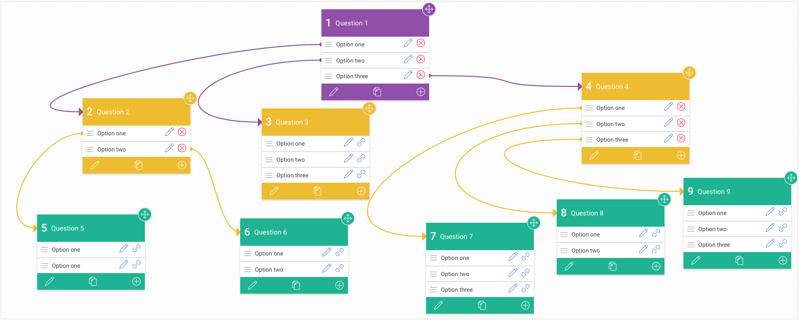
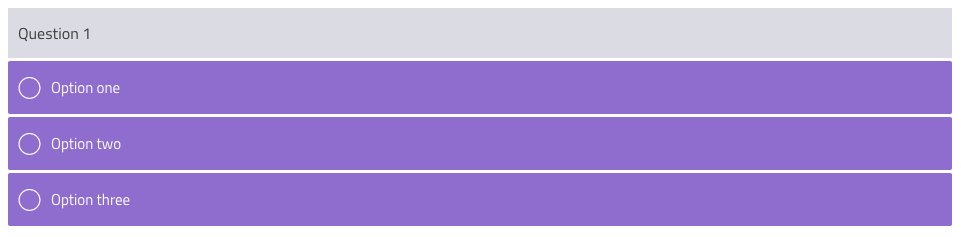
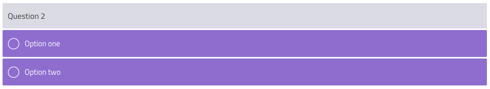

# Intellum Frontend Engineering Code Test

## Introduction

We would like you to write a highly interactive React branching question. Please use React and any other libraries around React to accomplish this task. However, you are not marked on the libraries you use - but how you use them.

The value of this task is two fold:

1. We get the opportunity to see your coding ability and judge whether your skill level is what the job role requires.

2. We get to see where your strengths and weaknesses are, so we can make sure you have access to the correct training material if you get the role.

This is also representative of the kind of interactions we build daily and is a good example of the work a Front-end engineer builds at Intellum.

## The Task

We would like you to create a branching scenario question where an end user is presented with a question and options. The user picks an option and is then given another question. When the user picks an option from this question they are shown another question with options.

The idea here is that if the user starts again, they should be able to select a different option in question 1 and follow a completely different path way.

You must also think about how the user finishes the branching question.

Please look at the image below for a detailed user flow:

The image above shows an example of what a user flow could be. Let's go over one of these to help detail a user flow.

If the user selects "Option one" from "Question 1" then they will be shown "Question 2". "Question 2" has only 2 options. The user selects "Option two". They are then shown "Question 6". After answering "Question 6" they have finished the branching scenario.

Examples of questions and options:

You will notice "Question 3" does not have any child nodes. This is intentional, as branching scenarios can have an unlimited set of branching nodes. Selecting an option in "Question 3" would end the branching scenario.

## Marking

Our review of this coding exercise looks at the following:

1. React code structure
2. Use of React principles and performance considerations
3. Semantic HTML
4. Styling and UI
5. Progamming ability
6. Data management
7. Bonus improvements

## Getting Help

If you have any questions please do not hesitate to contact me. These questions will not be held against you when marking.

## Submitting Your Code

To submit your work, please upload this to your personal github account and share this with me. We have initially set a week to produce this task. Please let us know if you feel this is unachieveable giving the reason why.

## Getting Started

Run `npm install` or `yarn install`
Then run `npm start` or `yarn start`

This should open a new browser window and all updates should be automatically picked up in the browser. Happy coding!!